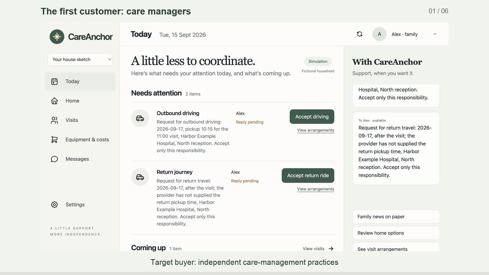

# CareAnchor

CareAnchor helps older adults arrange everyday support at home, connecting family and outside services around one shared plan. We are building toward the right help with less effort from the resident and family: use the household's preferences, budget and availability, reuse existing arrangements, and make each responsibility clear.

This hackathon prototype demonstrates hospital coordination: a resident asks for help, named family members accept separate duties, and a changed appointment reopens the affected arrangements. The initial customer hypothesis is independent care-management practices; older adults and their families use and benefit from the service. Reduced coordination effort remains an impact to test in real pilots.

[Run locally](#run-locally) · [Try visit coordination](#try-visit-coordination) · [Repository map](#repository-map) · [Project documents](#project-documents) · [Checks](#checks-and-boundaries)

## Watch the demo

[**Watch or download the 60-second demo (MP4)**](demo/careanchor-demo.mp4) · [Narration script](demo/transcript.md) · [Captions](demo/captions.srt)

[](demo/careanchor-demo.mp4)

The current cut has captions and no audio, ready for narration later. The one-minute pitch covers the target customer, product vision, working prototype, and intended impact. Recorded app interactions show two live GPT-6-Astra interpretations, separate family acceptances, and a changed hospital notice that requires fresh replies. The target buyer and impact remain hypotheses to test in real pilots. The recording uses fictional household/provider data in the web rehearsal; it does not depict an Apple Messages round trip. Model waiting time and pauses are shortened. This recording predates the optional visit-change monitoring below.

CareAnchor is the product; **GPT-6-Astra is the model**. The application calls the signed-in Codex desktop runtime for structured interpretations, validates the proposed actions in Python, and updates one shared household plan. This is a bounded agent workflow built without a separate agent framework. A controlled local Apple Messages self-chat test also verified automatic intake, a real model call, and an automatic reply shown as Delivered; a separate older-adult device and voice input have not been verified.

## Run locally

For a fresh checkout:

```sh
git clone https://github.com/yannickshaofengsun/CareAnchor.git
cd CareAnchor
```

From this folder, run:

```sh
python3 server.py
```

Open [the household demo](http://127.0.0.1:8765). The server binds only to this computer. Live chat uses the existing signed-in desktop runtime at `/Applications/ChatGPT.app/Contents/Resources/codex` and `gpt-6-astra`; it uses your existing model allowance. The older standalone CLI could not refresh this model's metadata, so the compatible desktop runtime is used without changing global configuration. If Astra fails, the app shows an error instead of substituting a scripted response.

The simulation and included home renders work without Blender or a model connection. Live chat requires the compatible macOS desktop runtime at the path above, a signed-in account with model access, and network access. Its runtime path and model are constants in `astra_bridge.py`; this repository does not provide credentials or install that runtime.

## Try visit coordination

1. Arrange a fictional hospital visit once through the resident chat, naming the driver, companion and return-ride helper.
2. In **Settings**, allow relevant household updates and optionally record each helper's own dated availability from their perspective. In **Resident → Visits**, allow hospital retrieval and visit requests; allow backup requests if reassignment should be possible.
3. Turn on **Watch visit changes**, then choose **Simulate hospital changing the visit**. CareAnchor checks the changed notice, current plan and availability for the new visit date through GPT-6-Astra, and creates separate responsibility requests.
4. Switch to each named helper's perspective to accept their own responsibilities. CareAnchor waits for those replies; one acceptance does not confirm the other duties or physical attendance.

Monitoring applies to changed notices for an existing fictional visit while the local server runs. It turns off after restart, preserves existing task identities for the same notice, and makes no model calls while the source is unchanged. It is not general continuous care or sensor monitoring. Live interpretation has the same model requirements as chat.

## Repository map

The demo uses Python's standard library and plain HTML, CSS, and JavaScript. There are no pip packages, npm dependencies, external database service, or frontend build step. The optional Apple Messages adapter uses a local SQLite ledger for receipt cursors and send claims. The runnable checks below cover household rules, persistence, HTTP boundaries, Messages filtering, and the public catalog.

| File or folder | Purpose |
| --- | --- |
| `web/index.html` | Browser interface, resident/family views, chat, and household controls |
| `server.py` | Local HTTP server, JSON endpoints, and asset serving |
| `hospital.py` | Fictional provider notices, visit responsibilities, and prescription logistics |
| `proactive.py` | Optional watcher for changed fictional visit notices, using the existing coordinator |
| `simulation.py` | Shared household state, role-filtered views, and scenario actions |
| `week.py` | Household-week planning, permissions, dependencies, and completion evidence |
| `astra_bridge.py` | Read-only chat and bounded action proposals through the signed-in desktop Codex runtime |
| `mission.py` | Outing mission, observed facts, human reports, and symbolic robot executor |
| `persistence.py` | Atomic, validated local snapshots without action replay |
| `coordination.py` | Named responsibilities, scoped preferences, dated availability, and bounded reminders |
| `assessment.py`, `meal.py`, `family_edition.py` | Home assessment, the illustrative meal routine, and an optional printed family edition |
| `imessage_bridge.py` | Optional private Apple Messages receipt and idempotent outbound transport |
| `mission_evaluation.py` | Five reproducible mission outcomes through actual runtime validators |
| `comparison.py` | Matched manual-versus-assisted simulation replays |
| `real_world.py` and `catalog/` | Curated U.S. online products and San Francisco local service references |
| `blender/` and `assets/` | Scene-generation scripts, editable scenes, exports, and rendered images |
| `demo/` | Silent 60-second video, captions, narration script, and recording notes |
| `docs/` | Project contract, scenario plan, memory/deployment design, and positioning research |
| `test_*.py` | Runnable checks for simulation, week, comparison, catalog, mission, persistence, evaluation, and server |

## Optional Apple Messages

Messages is disabled by default. Supervised activation requires macOS access to the local Messages database, an explicitly approved one-to-one participant/account mapping, a saved household, and a private configuration file under ignored `.runtime`. Its exact fields are `enabled` and `recipients`; each recipient has `actor_id`, `handle`, `account_id`, and `inbound_account`. The two account identifiers are distinct and must be verified. Never put private mappings in Git or derive recipients from message text.

With that configuration and a matching explicit baseline already established, start the supervised receiver:

```sh
python3 server.py --messages-config .runtime/messages-config.json --messages-poll
```

For initial setup, start with the private configuration, check `/api/messages/readiness`, then explicitly POST the resident role and current household revision to `/api/messages/baseline`. Baselining excludes older history and is never automatic. A changed mapping or receive mode needs a fresh baseline. Polling runs only while this server is running; there is no operating-system autostart.

The separately authorized same-account demo adds `--messages-self-test` to both flags above. It requires exactly one resident mapping and a fresh explicit baseline in that mode. Only new own-sent messages in that selected direct conversation beginning with case-sensitive `Astra:` are accepted. Normal mode excludes own sends. Audio, attachments, groups, and unsupported formatted messages are ignored.

The adapter can send real addressed updates when explicitly configured and permitted. `submitted` records a successful send invocation; delivery and read remain unknown. An uncertain send stays claimed across restart and is not automatically resent. Preserve both `.runtime/mission-state.json` and `.runtime/imessage-bridge.sqlite3`, along with the private configuration, when making a stopped-server backup; deleting the ledger is not a retry procedure. A clean second-machine installation and unattended operation have not been verified.

## Other rehearsals

### Outing mission

1. Choose a house and **Start outing rehearsal**. The appointment changes; the primary helper, relocated items, and a blocked symbolic route must be resolved in the same run. The resident chooses whether to proceed.
2. Set the mission permissions and departure target. **Ask CareAnchor to take the next step** sends only observed mission facts and permitted coordinator actions to GPT-6-Astra. It selects one action; the server validates the current revision and permissions before applying it. The proposal and accepted/rejected result remain visible.
3. Respond to requests using Resident and Family controls. Check each old item location before reporting a new observation. Morgan must accept backup help, confirm both travel legs, stage the papers, and report loading the bag. Knowing an item location alone never establishes preparation.
4. Dispatch the preloaded robot. Its first main-route steps reveal the blockage and stop movement. A resident-supplied usable alternate observation and route permission allow a new plan. The symbolic executor reports each step and delivery; Astra cannot invent those reports.
5. Try refusing backup, reporting no alternate, cancelling during movement, or advancing to the deadline. These remain unresolved, cancelled, or overdue. Success means ready to leave for the current appointment, not attendance.
6. Replay to reset the mission. The canonical server automatically saves to `.runtime/mission-state.json`; **Saved rehearsal** also offers explicit save/reload. A restart restores validated facts, permissions, pending requests, and robot position without repeating actions. Revisions advance across reloads so old confirmations cannot apply. Invalid saves show a load error and a fresh household.

The mission clock uses authored fictional minutes; it does not measure care time or physical travel. House renders remain unchanged. A separate symbolic route graph does not establish actual home paths, collision avoidance, clearance, robot training, or transfer to hardware.

### Shared week

1. Choose a fictional household. Expand **Household preferences and permissions** to edit independent preferences and bounded permissions.
2. Grant the routine permissions you want to test. Expand **Try a change in this fictional week** and introduce the clinic conflict.
3. Choose which commitment to preserve, then let the assistant complete permitted administration. Clinic acknowledgment and a requested ride remain separate facts.
4. Switch to Family to accept or decline the requested help. Try moved paperwork, unavailable supplies, cancellation, and a home-comfort need. A reported location, order acknowledgment, delivery, placement, and resident feedback are separate stages.
5. With **Your house sketch** selected, choose the illustrative bedside-caddy option. Preview the proposed change; preparation of a request does not establish installation.
6. Expand **Compare manual and assisted administration** for actual matched replays across all three situations.
7. Explore **Online products and local support** by need, channel, and optional budget. Review official sources, unknowns, and preparation checklists. These are public references; no provider has been contacted.

### Garden practice

1. Select **Your house sketch** or the **Example household**.
2. Try the clearly fictional garden activity, or choose **Keep my usual routine**.
3. If you try it, click the highlighted invitation, bedroom tote, and departure markers. The avatar moves as you prepare; the sketch's departure point is illustrative.
4. Optionally request company. Switch to Family to accept that request; readiness waits for acceptance if help was requested.
5. Replay to try a different choice. These are simulated outcomes, with no real signup or support request.

### Appointment and document changes

1. Move the appointment to Thursday. The previous ride confirmation becomes invalid.
2. Ask the resident chat what still needs arranging.
3. Switch to Family. Confirm or decline the new pickup.
4. Move the documents. Their recorded location becomes **last known**.
5. Switch to Resident and confirm the new document location.
6. Reset to replay the scenario. Each chat channel has its own conversation.
7. Select **Your house sketch**. Ask CareAnchor which room facts are confirmed and which dimensions are unknown. Expand **What CareAnchor knows** to inspect its house context. Changing homes clears both conversations; Reset preserves the selected home.

Chat explains the supplied plan and public source snapshots without taking actions. The mission coordinator separately selects one bounded action per requested run. The weekly routine button continues to execute deterministic simulation rules. None can supply a human acceptance, observation, loading report, or real transaction by generating text.

## Blender

`assets/home.blend` is the editable source scene; `assets/home.png` is its rendered overview; `assets/home.glb` is an exchange export. The browser uses the render, so this version tests coordination behavior rather than physical motion or renovation feasibility.

`assets/sketch-home.blend`, `.png`, and `.glb` reconstruct your latest interior sketch approximately. Three bedrooms and their queen beds are user-confirmed; the upper-left bedroom is R1. Other bedroom numbers remain unresolved. The two-apartment/eight-units-per-floor context is recorded, while the remaining apartments are not modeled. `assets/sketch-layout.json` separates confirmed facts, inferred geometry, and unknowns. Real dimensions, exact openings, and clearances are unmeasured. The source photos are not served by the web app.

`assets/sketch-adapted.blend` and `.png` show a proposed generic bedside caddy in R1 using the same camera. The original scenes remain unchanged. This generic $25 simulation fixture is separate from products in the public catalog; neither the visual nor a listed product establishes fit, safe reach, availability, or installation.

Blender is only needed to edit or rebuild scenes; the repository includes the generated assets. The following commands use the original workstation's local download, which is excluded from Git. On another machine, use your installed Blender executable in place of the `.runtime/` executable below.

The official Blender 4.5.13 ARM build is retained locally in `.runtime/`, with its published SHA-256 verified. It is mounted read-only, not installed into Applications. If the local download exists but the mount is absent after restart:

```sh
hdiutil attach -readonly -nobrowse -mountpoint "$PWD/.runtime/blender" "$PWD/.runtime/blender-4.5.13-macos-arm64.dmg"
```

Open the source scene:

```sh
open -a "$PWD/.runtime/blender/Blender.app" "$PWD/assets/home.blend"
```

Rebuild the scene and render:

```sh
.runtime/blender/Blender.app/Contents/MacOS/Blender --background --python blender/build_home.py -- --glb
```

Rebuild the sketch variant with `--python blender/build_sketch_home.py` using the same Blender binary.

## Project documents

- [Project contract](docs/PROJECT.md): direction, scope, state/API contracts and implementation checkpoints.
- [U.S. simulation plan](docs/US-SIMULATION-PLAN.md): fictional scenarios, delivery sequence and acceptance criteria.
- [Family memory and deployment](docs/FAMILY-MEMORY-AND-DEPLOYMENT.md): implemented continuity and the remaining family-installation design.
- [Positioning research](docs/YC-AGING-COMPARISON.md): selected comparisons and unvalidated business hypotheses.
- [Catalog notes](catalog/README.md) and [recording notes](demo/README.md): source boundaries and demo contents.

Plans and dated checkpoints describe their recorded scope; the runnable application and current checks establish implementation behavior.

## Checks and boundaries

```sh
for test in test_*.py; do
  python3 "$test" || exit
done
python3 mission_evaluation.py
```

Role tabs demonstrate filtered perspectives, with no login or real access control. The resident's fictional private appointment reason is omitted from the family view and family model context. Chat sends the selected role's scenario and selected house facts to OpenAI; the app is not offline. Do not enter real health information or personal appointments.

The matched replay records 19 manual versus 18 assisted human interactions in the nearby-support and couple cases, including setup; excluding setup gives 18 versus 16. The remote-helper case records 14 versus 14 including setup, with required work unresolved. Family-role interactions are unchanged in every pair: this does not demonstrate reduced unpaid family work or time. These are scripted role-bucket counts, with bundled setup and already-identified tasks, not individually measured workload, longitudinal results, or population estimates.

The canonical server keeps a validated local household snapshot; programmatic `Household()` and `Server(0)` tests default to isolated, unsaved state with Messages disabled. The shared week still uses fixed offers and immediate fictional responses. The separate mission advances an explicit clock and executes a symbolic route. Invitation/tote markers remain fictional game props. Appointments, rides, clinical decisions, bookings, and robot commands are simulated. Only the separately configured Apple Messages transport can read or send real messages; a message or accepted responsibility does not establish physical completion.

The mission evaluator runs five authored cases through the real validators: successful recovery, backup refusal, no alternate route, cancellation, and overdue work. It reports actual actions, resident/family role interventions, waits, rejected attempts, and unresolved outcomes. These scripts do not invoke GPT or demonstrate reduced family burden. A live HTTP Astra check separately verified a GPT-selected helper request and accepted validator result, with all unconfirmed work remaining unresolved.

The catalog contains 10 researched U.S. online products plus 6 existing public options across 13 needs, checked on September 8, 2026. Published specifications, fit checks, setup tasks, and source/manual conflicts remain visible. The two bathroom-support products require assessment; an address-specific shipping promise, safe fit, or installed total is not established. There is no live availability feed or provider integration. A listed item price does not establish an affordable delivered total. Public matches and checklists remain **not requested**; simulated orders and reports never change real-world coordination status.
